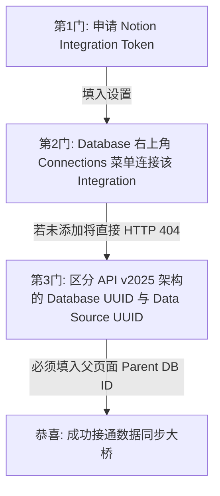

# 🚀 TaskPilot 现代智能效率控制台 —— 超详细使用手册
**版本**：v1.0.0-PRO  |  **核心驱动**：Tauri v2 + React 18 + Rust Security  |  **适用对象**：个人效率玩家、项目经理、系统运维工程师与全栈开发者

---

## 序章：认识 TaskPilot —— 为什么它是桌面办公的终极解法？

在日常高密度的碎片化办公中，我们经常遇到以下痛点：
1. 会议记录、邮件群聊、技术文档混杂，人工整理待办（To-Do）极其耗时且极易遗漏。
2. 普通的 AI 网页端工具需要反复“复制、切屏、打开网页、粘贴、转存到 Notion”，工作流极其碎裂。
3. 商业机密文件直接上传外部 AI 平台或 PDF 解析云平台，存在巨大的泄密隐患。

**TaskPilot** 应运而生。它不仅是一个 AI 客户端，更是一个以 **Agent-First（代理优先）** 理念重构桌面工作流的效率中枢：
* **像 Spotlight 与 uTools 一样的即用即走体验**：全球无边框透明悬浮，随时呼唤，视窗失去焦点自动隐匿，绝不喧宾夺主。
* **100% 本地离线文档与多模态解析**：PDF、Word、Excel、图片等全部在您本地电脑进程中完成解析与转录，守护商业隐私。
* **智能邮箱长链切片与手风琴折叠**：内置中英文兼容的正则切分与降噪引擎，自动将十几层转发的数万字邮件拆解为 100% 关注度的置顶回信与 20% 参考权重的历史回帖矩阵。
* **划选选词补漏与全栈 DOM 溯源**：支持鼠标拖拽任意文字一键生成待办，系统自动打标数据来源并完整映射同步至 Notion 数据库，审计核查一目了然。
* **防思考降级与防崩溃安检黑魔法**：独创底层驱动，在高速响应与深度逻辑推理之间自由切换，内置严密的架构护栏，让接口高可用、数据零流失。

---

## 第一章：环境准入与开箱首次启航

### 1.1 系统支持与运行环境
TaskPilot 采用目前最先进的跨平台框架 **Tauri v2** 编写，前端运行于超快渲染引擎中，底层调用操作系统原生的 WebView 和安全接口。
* **普通用户（强烈推荐）**：直接从发布页下载免安装便携版 `TaskPilot-Portable.exe`（Windows / macOS / Linux 对应包），双击即可运行，无任何运行时依赖。
* **源码二次开发者**：请确保本地已经成功配置以下编译基础环境：
  * **Node.js** ≥ 18.0.0 (推荐 LTS 版本)
  * **Rust** ≥ 1.70.0 (配合 Cargo 构建环境)

### 1.2 沉浸式桌面交互与“隐身”机制
启动 TaskPilot 后，您在任务栏可能甚至不会注意到它的存在。
* **全球快速唤醒**：默认按住组合键 `Alt + Space`（可自定义），交互视窗会在当前光标处或屏幕中央瞬间弹起。
* **智能失焦隐藏 (Focus-Loss Concealment)**：在主视窗任意外部区域用鼠标左键点击，或者切换到其他应用程序窗口时，TaskPilot 会自动将其自身优雅隐藏。
  > [!TIP]
  > **如何锁定窗口？** 当您在软件内触发**打开本地文件浏览器选择文件**或**开启全局屏幕截图**时，底层系统会自动暂停“失焦隐藏”机制，确保您选取文件或截图完成后，窗口能完美复原并接纳内容。

### 1.3 首次开箱的必须配置指南
初次唤醒窗口，请先点击界面右上角的 `⚙️ 设置` 按钮，进入四维参数控制台进行基础设定。

---

## 第二章：四维参数控制台设置 —— “三重门”与防坑指南

设置面板由四个标签页构成：`AI 大模型`、`Notion 集成`、`邮件任务监听`、`系统与日志`。**请务必仔细阅读本章中的警示块，它们是避免 API 报错与数据同步故障的关键！**

### 2.1 AI 大模型接入与“深度思考”调试 (AI Settings)
支持兼容 OpenAI 协议的任何标准接口（包括 OpenAI 官方、DeepSeek、Claude、本地 Ollama / vLLM 转发等）。

| 设置项 | 说明与最佳实践 |
| :--- | :--- |
| **API Base URL** | 接口访问基址。**注意**：无论是否以 `/` 结尾，底层会自动进行归一化修剪，推荐填入形式为 `https://api.openai.com/v1`。 |
| **API Key** | 您的个人密钥。系统会在底层将其交由 **Rust `Aes256Gcm` 硬件算法**局部加密保存在机器本地，绝不明文存盘。 |
| **模型名称 (Model)** | 例如 `gpt-4o`, `o1-mini`, `o3-mini`, `claude-3-7-sonnet-20250219`, `deepseek-reasoner` 等。 |

> [!WARNING]
> **深度思考 (Reasoning) 开关与 `/no_think` 降级黑魔法**
> 针对最新一代具有自我推理（Reasoning/Thinking）能力的模型（如 `o1/o3系列`、`DeepSeek R1/Reasoner`、`Claude 3.7`），应用提供了一个至关重要的选项：**“允许大模型进入深度思考模式”**。
> * **当开启该项时**：系统会下发长思考指令（例如自动为 Claude 分配 `4096 budget_tokens` 或给 O 系列下发 `reasoning_effort: "high"`），**这适合极其复杂的长期项目文档拆解，但响应时间会延长数倍，且 Token 消费大幅上升**。
> * **当关闭该项时（默认推荐）**：TaskPilot 将启动**双重压制技术**：
>   1. **API 参数降级**：向 API 强制注入 `reasoning_effort: "low"` 或 `{ thinking: { type: "disabled" } }`。
>   2. **提示词末端截断指令**：在发送给 AI 的 Prompt 最末端强制挂载：`\n(指令：请直接输出最终结果，跳过所有思维链、推导过程和思考步骤。)\n/no_think`。这不仅将生成延迟缩减到最快毫秒级，更能为您节省最高 80% 的思考费！

* **文本截断保护阀 (Token Limit)**：为防止您不小心粘贴数万字超长代码或乱码，导致接口抛出 Context Limit 异常甚至超额消费，系统默认把最大支持字符上限锁定在 `8000` 字符。超过该安全范围时，底端会自动修剪并打上：`...(文本已截断以保护 Token 限制)`。

### 2.2 Notion 数据库同步 —— 跨越“三重门”高防错误指引
Notion 强大的灵活性往往带来严苛的接口验证限制。请务必按顺序突破以下三道门槛：



1. **第一重门：Integration Token**：前往 Notion Developers 后台申请一个 Internal Integration Token，复制以 `secret_` 开头的字符串。
2. **第二重门：页面授权连接（🚨 90% 新手踩雷处！）**：
   仅仅在软件中填入 ID 是**绝对不够**的！您必须打开 Notion 中目标的 Database 页面，点击右上角的 **`...` 菜单 -> `Connections` (连接) -> 搜索并添加您刚刚创建的 Integration**。否则系统无论怎么请求，都会遇到致命报错 `HTTP 404 / Object not found`！
3. **第三重门：Notion API v2025-09-03 新架构 UUID 辨识**：
   请在使用与核对 ID 时务必留心！在最新的 Notion 嵌套数据库底层规范中，**Data Source ID 和 Database ID 彻底分离**。在配置 TaskPilot 时，`Database ID` **必须是用于创建 Page 的父层数据库 Parent UUID**。不要把子查询视图的 ID 错填进来，否则会在创建任务时触发 `400 Bad Request: Parent database not found`。

### 2.3 个人关注焦点与 AI 提示词智能润色 (Prompt Focus)
您不希望 AI 毫无章法地摘抄内容，您可以通过“个人关注点”对其定向指引：
* **输入案例**：*“我是项目负责人，请着重为我提取包含具体验收标准、下周三前必须交付的开发任务，忽略日常问候和茶水间闲聊。”*
* **✨ AI 智能润色助手**：在设置界面，您只需写下两句大白话（如“帮我多看点运维的事”），然后点击旁边的 `✨ AI 润色` 按钮，系统后台会自动唤醒大模型将您的口语改写为结构严谨、约束力强的大脑指令宏！

---

## 第三章：桌面核心工作流实战 —— 从极速抽析到沙盒映射

### 3.1 碎片文本捕捉与屏幕截图 OCR
在任何工作场景（例如看邮件、审阅 PDF、读即时通信长消息）：
1. **纯文字**：直接按下 `Alt+Space` 唤出面板，粘贴多段文字，按 `Enter`（或者按发送按钮）。
2. **多模态截图与图片**：
   * **快捷截图**：点击输入框右上方的 `🖼️ 截图` 按钮，窗口隐身，立即进入拉框区域截图功能。截图完毕自动贴入当前对话框。
   * **剪贴板直接粘贴**：如果您使用了微信截图、QQ截图或系统自带截图，在任务面板内直接按 `Ctrl+V` (Mac 下为 `Cmd+V`) 即可直接读取图片入库。
   * **灯箱与多图管理**：支持多张图片同时堆叠，鼠标经过缩略图点击右上角 `X` 可移除；点击图片本身即可唤醒全局高清黑场灯箱，查看细微报表数字。

### 3.2 离线拖拽文档解析引擎 —— 无云端、零外发
无需安装庞大的 Office 软件，您可以直接从桌面上将其拖拽进 TaskPilot 的窗口内（支持同时拖入多份文档混合处理）：
* **📄 PDF 文档**：由内置打包的本地离线 Web Worker (`pdfjs-dist`) 在客户端后台逐页扫描文字文本。
* **📝 Word 文档 (.docx)**：底层搭载 `mammoth` 引擎，智能剥离排版样式，精准提取纯净文本和表格段落。
* **📊 Excel 表格 (.xlsx, .xls) 与 .csv**：通过 `xlsx` 本地计算库，将电子表格秒级转换成易于大模型识别的二维字符矩阵。

### 3.3 Notion 动态属性映射沙盒：可视化拼装与“防崩溃安检”
为什么普通工具经常写不进 Notion 数据库？因为属性字段对不上！TaskPilot 在界面内置了一个强大的**动态属性映射沙盒**。
点击“拉取/刷新字段属性”，软件会自动扫描并呈现您目标 Notion Database 里的所有的已设列（包括文本、下拉选框、日期、单选复选框等）：

```
+-------------------------------------------------------------------------+
| [✓] 待办名称  | Name         | 字段类型: title       | 提示词映射 (默认)  |
| [✓] 紧急程度  | 优先级       | 字段类型: select      | 限定: [★, ★★, ★★★] |
| [✓] 预期完成  | 计划完成时间 | 字段类型: date        | 格式: YYYY-MM-DD   |
| [ ] 业务归属  | 项目模块     | 字段类型: multi_select| 限定: [前端, 运维] |
+-------------------------------------------------------------------------+
```

您可以在此处：
* **自由勾选**：勾选让 AI 在本轮提取时需生成的字段，不勾选则忽略，做到极简精简。
* **自定义字段 AI 提示词 (AI Hint)**：针对单个字段对模型施加强约束！例如针对“紧急程度”，您可以补充提示词：`"如果提及系统宕机，请强制设为 ★★★"`。
* **拖拽排序 (Drag & Drop)**：在列表拖拽调整顺序，决定了最终展示在待办列表中的视觉排布布局。

> [!CAUTION]
> **揭晓后台防崩溃安检 (Crash-Prevention Checkpoints) 机制**
> 为了防止由于 AI 抽风幻觉产生的坏数据导致整批次任务插入直接报错（HTTP 400），系统在真正发出 HTTP 同步请求之前，内置了严苛的过滤防火墙：
> 1. **严格时间过滤**：对于 `date` (日期) 类型字段，系统利用正则过滤匹配。如果 AI 返回了诸如 *“下周一”*、*“尽快”*、*“2026年3月”* 等非标准日期，系统会**为了保护主任务写入成功，自动剥离丢离非法的时间字段**！建议在提示词中一再向 AI 强调：`"所有时间必须换算成绝对格式 YYYY-MM-DD"`。
> 2. **下拉框 (Select/Multi-select) 枚举拦截**：如果 Notion 中给列定的下拉白名单是 `["高", "中", "低"]`，而 AI 却提取出了 `["极高"]`，发给 Notion 绝对会瞬间让整次会话宕机。本系统的转换层一旦发现非 Schema 白名单内的枚举值，将立刻对其进行静默剔除，确保主要文本成功同步至数据库。

### 3.4 进阶神技：AI 智能写作助手 (Writing Assistant)
在成功把一堆纷乱的文本和图片解构为清晰的 Todo 卡片之后，您常常还要为此向上汇报或者回复邮件。
无需重新复制出去！在主窗口中点击右下角的 **`✨ 写作助手`**：
1. 它会自动读取**本次您刚选取的待办事项卡片核心上下文**以及**原始解析材料的精简参考**。
2. 您只需在输入框表达意图：“*帮我写一封礼貌的给甲方技术主管的回复邮件，申明本周我们要优先解决哪些报错*” 或者 “*梳理一份供早上例会使用的周报概要*”。
3. AI 将直接为您生成排版优雅、逻辑严整的长文，直接拷贝即用！

### 3.5 智能邮箱处理：长链转发解构、800x600 手风琴矩阵与选词溯源
针对企业办公中极其高频的“十几层转发、高达数万字排版堆叠”的超长邮件（如项目周报、跨部门跟进链），TaskPilot 打造了一套专属的人体工学深度处理工作流。

#### 1. 自动切片与手风琴折叠矩阵 (Accordion Matrix)
当一封超长邮件由邮箱监听或者历史记录抓取入库后，点进 **`[ 📧 邮件原文与图片 ]`** 标签页，您将体验到极爽的 UI 降噪：
* **实时降噪数据统计**：页面顶部会自动提示本次排毒成果，例如：*“📉 智能降噪：已自动折叠 4 封往期会话，释放约 32,500 字冗余排版”*。同时右侧配备 `[⏬ 展开全部历史 / ⏫ 收起全部历史]` 一键控制按钮。
* **置顶本次核心正文 (100% 焦点)**：上方由橙/紫高亮边框包裹的卡片为**本次最新发信 / 回复的正文**，系统默认将其展开，让您在 800x600 紧凑窗口内第一眼就能抓住最新业务重点。
* **历史回帖手风琴矩阵**：下方往期转发记录会自动按 `#1`, `#2`... 顺位收折为一个整齐的抽屉列表，显示每个回帖的“发件人、发件时间、主题快览”。鼠标轻点任意一行，即可像手风琴般顺滑展开阅读细节。

#### 2. 解密 AI 调度逻辑：为什么万字长链不会让 AI 误提一年前的旧任务？
在传统工具中，把 30,000+ 字的转发邮件扔给 AI，AI 往往会迷失在陈年旧账里，把三个月前别人布置过且早已完成的任务重新提炼成今天的新待办。TaskPilot 依靠**“权重分级隔离黑魔法”**彻底破局：
* **切片解构**：底层 `emailScheduler.ts` 在发送请求前，预执行正则切分引擎 `parseEmailThread`；
* **权重分级提示词 (Prioritized Prompting)**：
  1. 将置顶的最新回复赋予 **100% 核心指令权重**：`【本次最新回信 / 核心重点（100% 关注）】`，强制大模型围绕其提炼最终动向；
  2. 将下方折叠的往期回帖打包降格为 **20% 弱背景参考**：`【历史引用与转发背景（仅供参考上下文 20%）】`。
* 这样一来，模型能以前因后果为背景，确保抓准真正的当务之急，绝不发生历史旧账误提。

#### 3. 划选选词生成待办的“全栈 DOM 溯源” (Traceable Highlight-to-Todo)
当您在核对或者重读历史回帖时（例如点开 `#2 往期回帖`），如果发现团队某个遗漏的待办事项没有被自动化捕捉，您可以：
1. 用鼠标左键在正文中直接**拖拽选中任意一段话或关键词**；
2. 窗口顶端立即弹出悬浮气泡：`已划选文字: ... [ ➕ 从划选生成待办 ]`，点击该按钮；
3. **自动打标溯源**：系统底层的 DOM 感知器会立刻识别这段文字来自哪个层级。若是顶部正文，自动贴上 `[最新发信正文]`；若是第 N 封往期回帖，自动贴上 `[引自历史回帖 #N]`！
4. **Notion 无缝映射**：生成后的待办标题将自动带上该简短编号，备注字段则自动注入全量说明：`(数据来源：引自历史回帖 #N)`。当这条任务同步至您的 Notion Database 后，团队在事后审计或者向上汇报核对时，来源定位一目了然！

#### 4. 双态阅读模式切换建议与极限容错承诺
在邮件阅读页的顶部，我们提供了一键切换 **`[ ☀️ 护眼白底原貌模式 / 🌙 深色纯净模式 ]`** 的引擎开关：
* **☀️ 护眼白底原貌模式（默认推荐）**：企业商业邮件（特别是 OA 审批、合同核对、财务对账单、监控系统告警）频繁使用特定的红色告警文字、表格背景色与艺术字体。针对此前“深色软件底色导致邮件黑色文字变黑隐形”的行业痛点，本模式在无边框视窗内构建了一张 100% 还原寄件人原生 HTML 布局的纯白卡片，彻底解决样式冲突与字体消融！
* **🌙 深色纯净模式**：适合夜间或暗黑环境下的沉浸式纯文本精读。底层 `DOMParser` 会主动清洗掉固化的行内字体颜色与背景标签，重塑为高对比度的暗黑排版。
* **🛡️ 极限容错降级保证 (Fallback Mechanism)**：如果遇上极特殊自定义企业客户端（其分隔线不符合常规中英文 Outlook, Foxmail, QQ, 163 等格式），系统**绝对不会报错或崩溃**。切片引擎将无缝安全降级为“单片全量文本模式”，并借助 8000 字智能安全截断与分级提示词兜底，始终保障您的内容稳定呈现与精准抽取。

---


## 第四章：后台自动化引擎 —— 邮箱 IMAP 任务监听与重置

不仅能主动唤醒，TaskPilot 还是您默默工作在幕后的专属小秘书。通过邮箱监听，它能在每天早上上班前自动读取收件箱里的客户投诉或技术工单，自动提取待办写入 Notion！

### 4.1 IMAP 协议与凭证绑定
在设置面板的 `邮件任务监听` 选项卡进行挂载：
* **连接类型**：标准 IMAP (如 `imap.qq.com`, `imap.exmail.qq.com`, `imap.gmail.com` 等)，默认端口 `993` (自动启用 SSL 安全通道)。
* **⚠️ 账号安全红线**：您的密码一栏，请绝对不要使用您的普通邮箱网络登录密码！请必须去对应的邮箱厂商后台开启 IMAP 服务，并申请并填写授权的一串**“专用客户端密码 / 授权码 (App Password)”**。

### 4.2 定时调度策略设置
您可以精细控制后台静默扫信的工作流规则：
* **监听频率 (Schedule Time)**：可选如 `每小时执行一次 (every_1h)`、`每3小时 (every_3h)` 或指定具体的每天固定时辰（如早上 `09:00` 自动冲刺一次）。
* **生效时间与周表**：勾选周一至周五工作日运行，避开周末打扰。
* **处理动作**：您可以设置当扫描完毕并提取好任务后，**是否静默将其标记为已读 (Mark as Read)**，以及**是否自动静默同步写入到 Notion 数据库 (Auto Sync to Notion)**。开启自动化后，早上到工位打开 Notion 即可看到系统已为您备齐一天的 Todo！

### 4.3 邮件指纹防重复机制与“文件夹重建陷阱”
为了防止每次自动定时任务跑起来的时候重复把老邮件又生成一遍待办，系统在本地采用基于 SQLite / Zustand Store 的高强度唯一去重指纹库。
* **指纹计算公式**：`文件夹真实名称 + "_" + 邮件内部服务器 UID` (例：`INBOX_10482`)。

> [!IMPORTANT]
> **排错指引：为什么整理邮箱文件夹后，老邮件突然被重新抓取了？**
> 根据 IMAP 底层网络协议规范，当您在网页邮箱里对文件夹进行了“改名”、“移动”、“删除并重新建立”操作后，邮件服务商底层的存储索引会发生变化，重新为这些邮件分配完全不同的全新内部 ID（UID）！
> 这会导致指纹验证失效。如果在实际运维中遇到此类重复抓取现象，解决方案极简：
> 1. 点击进入软件的 `📧 邮件任务历史与监控` 面板。
> 2. 点击右侧醒目的 `🗑️ 清空本地日志/索引` 按钮。
> 3. 软件会彻底刷新历史比对库，以全新的本地快照重新建立防重边界，问题即刻化解。

---

## 第五章：历史数据回放与快照级零耗能重试

工具再强，由于办公网络不稳定或者第三方 API 宕机，也有偶尔写失败的时候。TaskPilot 在设计初就给您吃了一颗定心丸。

### 5.1 历史记录追踪与原图/原文件反查
点击主界面的 `🕒 历史记录` 按钮，您可以查看到以前每一次 AI 成功提取出的待办快照，包括每一项的状态（成功/失败）。
不仅是查待办结果，点击历史卡片右上角的 **`查看材料 (Context View)`**，系统将以前处理时绑定的**原始纯文字内容**和**全部历史高清截图**原好无损地复写在输入窗内！无论过去了多久，您的原始凭据都有据可循。

### 5.2 网络波动同步失败？大胆重试，绝对“零 Token 消费”！
如果批量生成了 5 个待办，在准备写入 Notion 时办公室的 Wi-Fi 突然断了，或者恰逢 Notion 官方服务器抛出了 HTTP 500 临时故障。报错弹窗出现。
此时请注意：**当网络恢复后，您只需要在历史面板或者主页上点一次 `🔄 重新同步 (Retry)` 按钮！**

> [!NOTE]
> **为什么重试绝不会扣减您的 AI 额度？**
> 本应用在核心算法设计上实施了 **“快照隔离 (Snapshot Isolation)”** 架构。AI 的工作流（语言推导与格式化）和同步工作流（HTTP 写入 Notion）是在逻辑上完全隔断的。
> 只要大模型成功将没有结构的文本转变成了优美的结构化 JSON 待办格式，这一完整的 JSON 树即瞬间作为本地快照缓存落地。因此，之后的每一次因为网络故障触发的“重试”与“重新同步”，底层发送的都**纯粹是往 Notion 接口的轻量 JSON 数据包**，不再发送任何一丁点请求给 OpenAI 或 Claude。做到真正实现“一次算力消耗，终身稳定同步”。

---

## 第六章：系统控制、本地安全与高级调试 (System & Security)

### 6.1 Rust 硬件级 `Aes256Gcm` 局部密箱
针对注重商业和个人数据安全的用户，手册明确释疑：
 TaskPilot 没有官方后端服务器去收集和监听您的数据。所有应用设置保存在本地操作系统的应用数据目录下（如 Windows 的 `%APPDATA%/.gemini/antigravity-ide/` 或软件数据路径中的 `settings.json`）。
而且，针对您在设置里输入的 API Key、Notion Token、邮箱连接密码，软件在保存存盘前会直接跨向后台 Rust 层，调用硬件安全模块将机密内容进行 **Aes256Gcm** 加密写盘。任何第三方外部木马或者人工用记事本打开设置配置，看到的也只是无法破译的乱码 Base64 密文。

### 6.2 快捷键冲突排查与重定义
若默认的 `Alt+Space` 与您的系统其他快捷键冲突：
在“系统设置”页面找到全局快捷键输入框，点击将其激活，直接在键盘上按下您心仪的新组合键（例如 `Ctrl+Alt+T`，或 `Super+Space`），右侧点击 `保存` 即在 Rust 核心层中完成旧快捷键的解除注册与新快捷键的全局拦截监听。

### 6.3 终极调试者武器：全参数底层日志系统 (Logger)
如果我们在接入第三方私有部署模型，或者调试复杂的定制 Prompt 时遇阻怎么办？
请打开设置中系统界面的 **`开启底层调试日志 (Enable Logging)`** 开关！
开启后，应用程序会在终端控制台与运行态内部输出**发向大模型与 Notion 接口的全量 Payload 白盒日志**（为保护视野，Base64 超长图片数据将被优雅折叠提示 `[Base64 Image Data omitted]`，但所有的数组结构、模型名称、思考域分配比例、提示词宏参数将以 JSON 原样无损向您吐露）。这成了项目排错运维的最大依仗。

---

## 第七章：开发者拓展专区 —— 如何与外部脚本与生态打通？

TaskPilot 不仅是一个独立的应用，它的开放架构允许脚本运维人员通过代码与其双向联动。在项目源工程的 `/example` 目录下，我们为您精心准备了一套精简无侵入式的 Python 拓展脚本库。

### 7.1 案例精讲：如何通过外挂定时任务给 Notion 注入任务？
在运维或项目实战中，我们有时想要在特定时间点（如每周一上午 10 点前）准时通过定时任务向数据库直接插入一条“每周常规安全巡检整改”这种固定待办。
您可以直接参考参考我们提供在示例脚本库中的 `example/add_weekly_notice_todo.py`！它的架构美学极其优美：

* **零第三方依赖 (Zero External Dependencies)**：
  不同于一般要求装一堆 `pip install notion-client`、`requests` 的杂乱脚本，该通用脚本为保障服务器跨环境迁移的极高适配性，**仅调用 Python 原生标准库 `urllib.request` 与 `json`**！只需部署脚本和 Python，无论任何干净的 Linux/Windows 机器均直接秒开执行。
* **脚本核心代码剖析（对接 v2025-09-03 协议的绝对标杆）**：

```python
# !/usr/bin/env python3
import json, urllib.request, urllib.error
from datetime import datetime, timedelta, timezone

# 读取您的凭据配置
NOTION_KEY_FILE = "/home/kove/.config/notion/api_key"
NOTION_API_VERSION = "2025-09-03" # 紧扣最新标准
TASK_DATABASE_ID = "0d1ae4cd-6d70-4652-a813-f281827f4742" # 用于挂载的父数据库 Parent ID
PROJECT_PAGE_ID = "d45843da-573b-40e6-b341-c4977d7748e5"  # 关联目标日常项目的 ID

def get_wednesday():
    """纯逻辑算力：推导计算本周三精确日期 YYYY-MM-DD，防报错"""
    now = datetime.now(timezone(timedelta(hours=8)))
    days_ahead = (2 - now.weekday()) % 7
    if days_ahead == 0: days_ahead = 7
    return (now + timedelta(days=days_ahead)).strftime("%Y-%m-%d")

def create_notice_todo():
    wednesday = get_wednesday()
    page_body = {
        # 严格遵守 v2025-09-03 必须显式申明 type: "database_id"
        "parent": {"type": "database_id", "database_id": TASK_DATABASE_ID},
        "properties": {
            "Name": {"title": [{"text": {"content": "运维业务室系统运维问题整改推进工作"}}]},
            "优先级": {"select": {"name": "★"}},
            "任务类型": {"select": {"name": "会议"}},
            "所属项目": {"relation": [{"id": PROJECT_PAGE_ID}]},
            "计划完成时间": {"date": {"start": wednesday}},
            "完成": {"checkbox": False}
        }
    }
    # 通过标准库底层直接构造安全 HTTP 报文向云端派发！
    req = urllib.request.Request(
        "https://api.notion.com/v1/pages", 
        data=json.dumps(page_body).encode("utf-8"), 
        headers={
            "Authorization": f"Bearer {open(NOTION_KEY_FILE).read().strip()}",
            "Notion-Version": NOTION_API_VERSION,
            "Content-Type": "application/json"
        }, method="POST"
    )
    with urllib.request.urlopen(req) as resp:
        print("✅ 脚本执行完毕，任务已同步写入！", json.loads(resp.read().decode("utf-8"))["id"])
```

**【使用策略建议】**：您可借助系统的 `crontab -e` (Linux/macOS) 或 **“Windows 任务计划程序”**，将以上的原生自动化脚本格加入调度，搭配 TaskPilot，实现人机协同的完美自动化运维闭环。

---

## 附录：常见故障诊断与高频 FAQ (Troubleshooting & Quick Answers)

| 症状 / 错误表现 | 真正架构起因 | 解决方案与自查手段 |
| :--- | :--- | :--- |
| **面对数万字的长链转发邮件，AI 是否会误提很久以前的旧任务？** | 担心大模型处理大段历史转发回帖时发生注意力涣散或把往期周报的旧任务提出来。 | **绝不发生**。底层发送给 AI 前预执行了切片引擎，将本次最新回复设定为 **100% 核心焦点**，往期回帖降格为 **20% 历史参考**，实现严格的注意力分级与隔离。 |
| **在手动选词补漏时，同步到 Notion 后怎么看这个任务到底是谁说的？** | 在大量回帖中手动拖拽生成待办，担心后续团队核查时找不到最初的发件人和上下文。 | 系统已集成**全栈 DOM 溯源标记**。您鼠标在第 N 封回帖选词点击生成后，标题与备注会自动注入 `[引自历史回帖 #N]` 标签，并原样同步至 Notion 表格。 |
| **如果收到极特殊的邮件客户端发来的邮件，分隔线识别不了会报错吗？** | 担忧非标准邮箱客户端的格式未触发切分算法，导致程序崩溃或界面展示异常。 | 系统拥有**极限容错降级机制 (Fallback)**。遇到未知格式会平滑降级为单片全量模式，借助 8000 字安全防爆阈值与多层总结兜底，确保 100% 稳定运行。 |
| **企业 HTML 邮件在深色纯净模式下原本的彩色表格和排版乱了？** | 深色纯净模式为了防止暗黑背景黑字不可见，强行用 `DOMParser` 清洗了原有的 CSS 样式。 | 建议在阅读复杂合同、对账报表及企业彩排邮件时，切换为顶部的 **`[ ☀️ 护眼白底原貌模式 ]`**，即可 100% 还原寄件人排版，白天夜晚清晰对照。 |
| **Notion 同步报 `HTTP 400 Bad Request`** | 1. `parent` ID 填入了错误的 Data Source ID。<br>2. 存在 AI 生成的枚举选项不在表头下拉选项白名单中。<br>3. 日期不是标准日期字符格式。 | 1. 检查填写的 DB ID 是不是 Database Parent UUID。<br>2. 检查 Notion 列属性并点击设置窗中的“拉取字段”完成对齐。<br>3. 在关注点提示词里强化规定日期格式。 |
| **Notion 同步报 `HTTP 404 Object Not Found`** | Integration 缺少了该页面的真正控制授权。 | 在目标数据库的右上方 `...` 菜单的 `Connections` 中手动加入您的 Integration。 |
| **应用调用 AI 报 `Context length exceeded`** | 粘入了一份数万字的极端超长文本或者大图片，导致超出了 API 侧会话限制长度。 | 在“设置”界面中检查并缩减“Token 截断最大阈值”（建议调低至 6000 或 4000 字符内），系统将按安全上限拦截保护。 |
| **使用推理模型时响应时间长，或报参数异常** | 勾选了“深度思考模式”，触发了 API 大幅算力推导；或使用了不支持深度思考的模型却发了错指令。 | 检查该大模型是否兼容。若无需长文思考，请将“开启深度思考”勾选关闭，以唤起底层的 `/no_think` 与极速轻量参数映射黑盒。 |
| **邮箱每天重复生成旧邮件的对应任务** | 重建、改名、移动过邮箱端文件夹，导致邮箱协议端自动重置分配了所有的内部邮件 UID 索引。 | 前往软件右下方的 **`📧 邮箱监听与历史面板`**，一键按击右边的 **`🗑️ 清空记录/重置索引`**。 |
| **按了全局快捷键但窗口就是按不出来？** | 当前设定的快捷键（如 `Alt+Space`）被操作系统主视窗或第三方工具（如 Powertoys, uTools, 微信截图等）先一步抢占注册拦截。 | 点进设置面板重新设定一组不那么容易撞车的组合键（例如 `Ctrl+Shift+Space` 或 `Alt+X`），保存即更新主核心拦截器。 |
