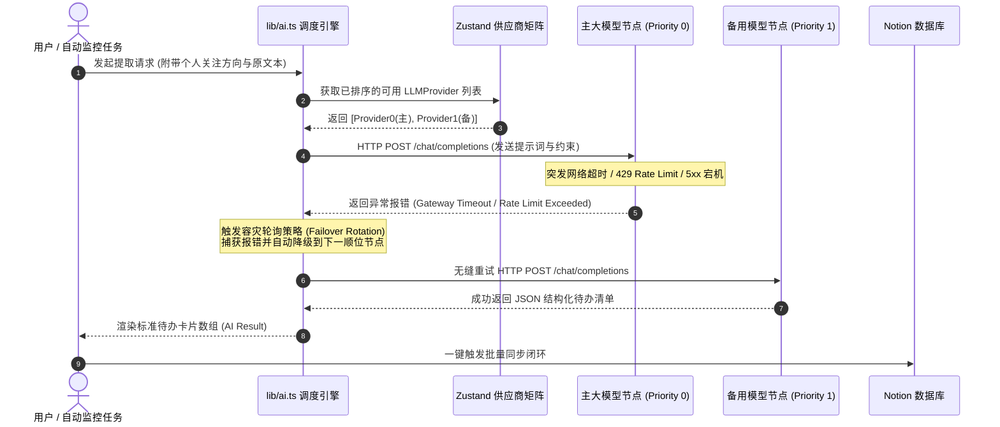
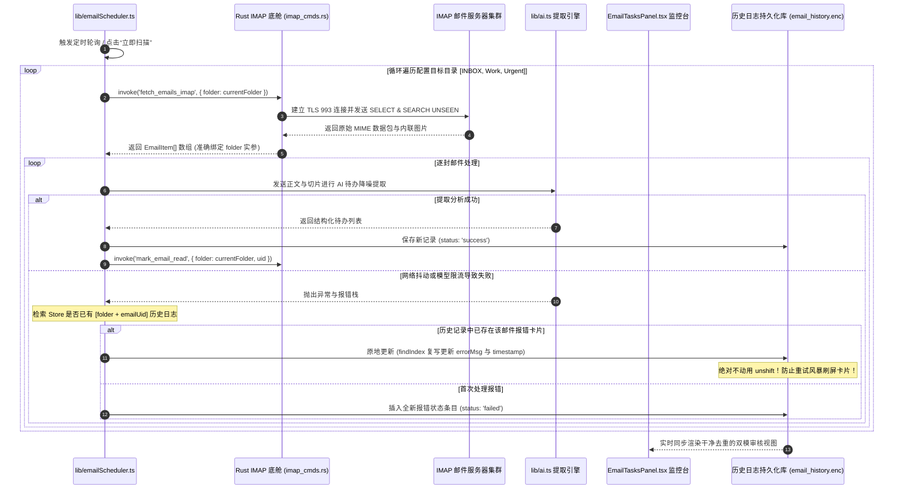

# TaskPilot 现代智能效率控制台 —— 概要设计说明书 (HLD)

**文档版本**：v1.0.0 (Release Edition)  
**更新日期**：2026-07-27  
**受众对象**：系统架构师、后端/前端研发人员、技术主管、运维部署工程师及系统评测人员  
**归档位置**：`doc/TaskPilot概要设计说明书.md`  
**关联规格**：[《TaskPilot 软件需求规格说明书 (SRS)》](./TaskPilot需求规格说明书.md)

---

## 1. 引言 (Introduction)

### 1.1 编写目的
本文档为 **TaskPilot 现代智能效率控制台** 的系统概要设计说明书（High-Level Architectural Design Specification, HLD）。本文档在《软件需求规格说明书 (SRS)》的基础上，阐述了系统的整体架构分层、模块划分、核心技术选型、关键业务流程的时序流转、IPC 接口通信契约及系统安全与容灾体系。本文档将作为后续详细设计、代码编写、架构评审与系统重构的指导性技术基石。

### 1.2 设计目标与架构原则
系统面向高频复杂的知识工作与跨组织协同工作流，核心设计构建在以下四大工程原则之上：
1. **沙箱优先与零外部依赖 (Sandbox-First & Zero External DB)**：摒弃沉重的 MySQL/PostgreSQL 外部数据库依赖，全链路数据（敏感凭据、待办历史、邮件切片）均采用加密序列化结构在客户端本地沙箱内存及文件系统闭环流转，实现对用户透明且数据 100% 自控。
2. **职责分层与极速通信 (Layered Separation & Fast IPC)**：利用 **React 19** 实现高帧率自适应响应式视图，利用 **Rust (Tokio)** 底舱承载耗时重负荷网络通信与文件解构，通过高效的 **Tauri IPC Bridge (Invoke/Event)** 进行异步数据传输。
3. **永不宕机容灾路由 (Zero-Downtime Failover)**：面对大模型接口极易发生网络波动或限流的现状，构建多供应商矩阵轮询故障转移引擎，实现核心业务链层面的自动重试与节点切换。
4. **自适应视窗约束 (Adaptive Windowing)**：全界面遵循 **1024×768 黄金自适应视窗规范**，结合手风琴折叠矩阵与沉浸式悬浮窗 (`ZenEditorModal`)，消除跨屏幕适配与长文档排版的布局碎裂问题。

---

## 2. 系统总体架构与分层设计 (System Architecture)

### 2.1 系统整体分层架构图
系统采用严谨的四层架构设计，各层间单向数据流和异步总线驱动：

```mermaid
graph TB
    subgraph "表现层 (Presentation Layer - React 19 + Tailwind CSS)"
        UI_MAIN[主工作台视图 App.tsx]
        UI_EMAIL[邮箱监听与审核工作区 EmailTasksPanel.tsx]
        UI_SETTINGS[系统配置与供应商面板 SettingsPanel.tsx]
        UI_ZEN[沉浸式大视野编辑窗 ZenEditorModal.tsx]
    end

    subgraph "状态与业务逻辑层 (State & Logic Layer - Zustand + Core Libs)"
        STORE_SYS[全局系统状态与持久化适配器 store.ts]
        LOGIC_AI[AI 智能路由与故障转移引擎 lib/ai.ts]
        LOGIC_SCHED[IMAP 后台轮询与防风暴中心 lib/emailScheduler.ts]
        LOGIC_PARSE[MIME 邮件切片与多模态文本解析 lib/emailThreadParser.ts & parser.ts]
    end

    subgraph "Tauri IPC 异步通信桥接层 (Tauri IPC Bridge Layer)"
        IPC_INVOKE[命令调用总线 tauri::command invoke(...)]
        IPC_EVENT[事件订阅通知总线 emit(...) / listen(...)]
    end

    subgraph "底舱服务与操作系统驱动层 (Rust Core / OS Layer)"
        RUST_IMAP[IMAP/TLS SSL 网络客户端 imap_cmds.rs]
        RUST_CRYPTO[本地加密沙箱持久化引擎 LazyStore / AES-ChaCha20]
        RUST_FS[操作系统文件 I/O & Office 文档原生解析转译]
        RUST_OS[OS 全局热键捕获 / 系统托盘 / 原生消息弹窗]
    end

    UI_MAIN & UI_EMAIL & UI_SETTINGS & UI_ZEN --> STORE_SYS
    STORE_SYS <--> LOGIC_AI & LOGIC_SCHED & LOGIC_PARSE
    LOGIC_AI & LOGIC_SCHED & LOGIC_PARSE <-->|Invoke / Event| IPC_INVOKE & IPC_EVENT
    IPC_INVOKE & IPC_EVENT <--> RUST_IMAP & RUST_CRYPTO & RUST_FS & RUST_OS
```

### 2.2 模块职责划分
1. **表现层 (Presentation Layer)**：
   - `App.tsx`：统筹左侧快速输入区、中间多模态文件上传响应与右侧待办结果生成与 Notion 同步面板。
   - `EmailTasksPanel.tsx`：承担“全景历史聚合列表”与“逐条深度审核模式”的双重视图渲染，支持查看邮件原文、局部手风琴折叠与已审核状态写回。
   - `SettingsPanel.tsx`：集中配置 API 矩阵、Notion 数据库 Schema 动态映射、《个人关注方向》等业务偏好。
   - `ZenEditorModal.tsx`：提供 900x640 沉浸式大窗编辑器，内置字数统计、AI 智能润色及防丢失变更检测拦截。
2. **状态与逻辑层 (Logic Layer)**：
   - 采用 `Zustand` 构建支持异步数据持久化挂钩的单向数据流状态机。
   - 封装网络重试逻辑、文本清洗切片逻辑及与第三方 RESTful 接口的会话装填。
3. **Rust 底舱驱动层 (Rust Core)**：
   - 基于 Tokio 异步多线程执行器，实现非阻塞式的网络套接字连接与高密级本地计算。

---

## 3. 关键业务时序与架构设计图 (Key Technical Sequence Diagrams)

### 3.1 多层大模型故障转移轮询路由时序图 (LLM Failover Engine)
为了确保长链复杂分析及高频请求不过载，系统设计了动态路由与自动降级容灾流：



### 3.2 IMAP 异步多目录轮询与重试风暴去重时序图 (IMAP Polling & Deduplication)
多文件夹监听（如 `INBOX, Work, Urgent`）和网路异常重试时，通过复合主键匹配实现日志原地更新，杜绝重复卡片堆砌：



---

## 4. 接口与通信协议设计 (IPC & Interface Design)

### 4.1 前端 UI 至 Rust 底舱的 Tauri IPC 命令矩阵 (`Tauri Commands`)
前端所有底层敏感操作均通过 `@tauri-apps/api/core` 的 `invoke` 命令接口调用 Rust 底舱。系统核心 IPC 矩阵规范如下：

| IPC Invoke 命令名 | 前端请求参数接口 (Arguments Schema) | 后端返回类型 (Return Type) | 核心功能设计说明 |
| :--- | :--- | :--- | :--- |
| **`test_imap_connection`** | `{ host: string, port: number, ssl: boolean, user: string, pass: string }` | `Result<string, string>` | 测试 IMAP 账户登录凭据有效性与 SSL 握手连通性。 |
| **`fetch_emails_imap`** | `{ host: string, port: number, ssl: boolean, user: string, pass: string, folder: string, limit?: number }` | `Result<ImapEmailItem[], string>` | 连接目标文件夹抓取未读邮件，转译 MIME 为 UTF-8 文本并解析内联附件图片 Base64。 |
| **`mark_email_read`** | `{ host: string, port: number, ssl: boolean, user: string, pass: string, folder: string, uid: number }` | `Result<boolean, string>` | 在指定的 IMAP 目录中，为特定 UID 邮件打上服务器端已读标签 `\Seen`。 |
| **`save_store`** | `{ key: string, value: string }` | `Result<void, string>` | 将用户敏感凭据或海量历史数据利用加密沙箱序列化持久化至本地 `.enc` 存储中。 |
| **`load_store`** | `{ key: string }` | `Result<string | null, string>` | 从加密沙箱中解密读取本地配置数据流。 |

### 4.2 Notion REST API 动态映射交互包格式
在与 Notion 协同进行数据内省和同步时，系统动态组装适配 Database Schema 各种字段类型的 JSON Payload 契约：
```json
{
  "parent": { "database_id": "8e9b-4c5a-8f1e-3b2a..." },
  "properties": {
    "任务主题": { "title": [{ "text": { "content": "修正线上 IMAP 多文件夹鉴权报错" } }] },
    "详细描述": { "rich_text": [{ "text": { "content": "来源于发件人: admin@company.com..." } }] },
    "状态": { "status": { "name": "待处理" } },
    "处理优先级": { "select": { "name": "P0-紧急" } },
    "截止时间": { "date": { "start": "2026-07-28" } },
    "溯源链接": { "url": "https://mail.company.com/view?uid=109283" }
  }
}
```

---

## 5. 错误处理与容灾体系设计 (Error Handling & Fault Tolerance)

系统在处理复杂的跨网络、跨多模态解析工作流时，确立了三级容灾防御机制：

### 5.1 级联熔断与故障转移 (Fallbacks & Circuit Breaking)
1. **大模型网关熔断**：捕获所有 HTTP 状态码为 `408`, `429`, `500`, `502`, `503`, `504` 或 `NetworkError` 的网关异常，不向用户抛出原生堆栈，而是记录日志后立刻触发 `Failover Engine` 切换顺位模型。
2. **IMAP 会话中断保护**：在处理多文件夹（如 `INBOX, Work`）时，若其中某一个文件夹因为权限或拼写错误异常中断，底舱仅跳过该目录并在控制台记录一条静默警告，**绝不阻断下一个文件夹的正常拉取工作流**。

### 5.2 防误删与交互拦截 (UI Safety Guard)
1. **沉浸窗脏状态校验 (`Dirty Check`)**：在 `ZenEditorModal` 组件内挂载实时比对哈希。若用户修改了规则文本且未调用 `onSave` 触发直接退出，必须调起拦截对话框要求用户显式确权。
2. **Notion 闭环空选防护**：当执行批量推送时，系统对可选集 `selectedTodos.filter(t => t.selected !== false && !t.synced)` 进行非空断言。若数量为 0，调起原生人性化弹窗指导，杜绝静默无效调动。

---

## 6. 系统安全与资源性能架构 (Security & Performance)

### 6.1 安全保护机制
1. **沙箱零泄漏隔离**：应用程序工作在 OS 限制的 Webview 沙箱内。PDF / Word / Excel 文件的读取通过 Rust 内存转换直接转为纯文本，系统临时工作内存用完即释。
2. **静态凭据加密存储**：系统严禁把 API Key、Notion Token 和邮箱密码明文写如 `localStorage`。所有配置在持久化时一律交由 Rust 端底层 `LazyStore` 的 **ChaCha20-Poly1305 / AES** 加密落盘。

### 6.2 性能预算与自适应管理
| 架构设计约束点 | 设计策略与底层优化方案 |
| :--- | :--- |
| **海量邮件长文本处理** | 引入 **IMAP Slice 切片算法**，通过 `-----Original Message-----` 和头部正则切割盖楼信息，使传递给 LLM 的 Token 量巨降 60%-80%，保障解析速度低于 500ms。 |
| **内存与渲染帧率控制** | 历史记录列表超过 1000 条时采用虚拟滚动与分页归档加载；手风琴展开与沉浸式大视窗统一启用 CSS GPU 硬件加速缩放，确保 1024×768 下帧率稳居 60 FPS。 |
| **无闪烁自适应滚动** | 全页面布局采用 Flexbox 嵌套自适应高度 (`h-[calc(100vh-...)]`) 与 `overflow-y-auto` 内部局部自闭环滚动条，彻底杜绝外层整体视窗发生双重套娃滚动轴。 |
