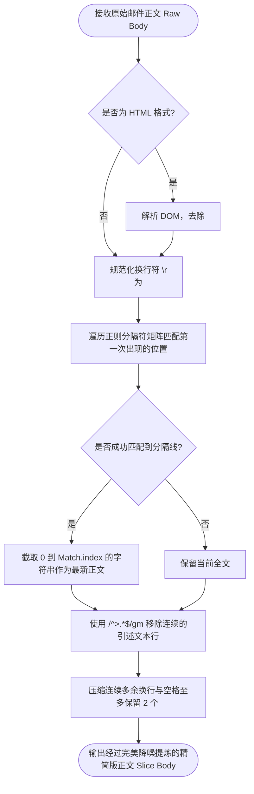

# TaskPilot 现代智能效率控制台 —— 详细设计说明书 (LLD)

**文档版本**：v1.0.0 (Release Edition)  
**更新日期**：2026-07-27  
**受众对象**：核心研发工程师、前端/后端开发人员、单元测试及自动化测试工程师、架构重构人员  
**归档位置**：`doc/TaskPilot详细设计说明书.md`  
**上游引用**：[《TaskPilot 概要设计说明书 (HLD)》](./TaskPilot概要设计说明书.md)、[《TaskPilot 需求规格说明书 (SRS)》](./TaskPilot需求规格说明书.md)

---

## 1. 引言与设计概述 (Introduction & Overview)

### 1.1 编写目的
本文档为 **TaskPilot 现代智能效率控制台** 的详细设计说明书（Low-Level Detailed Design Specification, LLD）。在概要设计（HLD）完成总体分层架构与通信时序定义的基础上，本文档深入剖析了系统每个核心组件、逻辑函数、状态机切片及 Rust 底舱模块的**内部算法逻辑、数据流转化流程、具体类/结构体与函数签名设计**。本文档可作为程序员直接进行编码实现、代码审计、单测用例编写及后续微重构的精密施工蓝图。

### 1.2 详细设计范围
本说明书全面覆盖以下四大工程技术领域的底度内部实现：
1. **全局状态机与沙箱持久化引擎** (`src/store.ts`)
2. **核心业务处理算法层**（长链邮件切片 `emailThreadParser.ts`、大模型故障转移 `ai.ts` 与去重轮询调度器 `emailScheduler.ts`）
3. **关键 UI 呈现组件内部构造**（沉浸编辑窗 `ZenEditorModal.tsx` 与邮箱双视图面板 `EmailTasksPanel.tsx`）
4. **Rust 底舱网络及解构引擎**（IMAP 套接字通信解析 `imap_cmds.rs` 与多模态沙箱文件转换引擎）

---

## 2. 前端数据状态驱动层详细设计 (`src/store.ts`)

系统摒弃了传统的 Redux/Context 模式，采用 TypeScript 强类型的 `Zustand` 状态库，并通过自定义防抖中间件与底层 Tauri 沙箱文件加密存储 (`LazyStore`) 构建持久化映射。

### 2.1 全局设置状态机 (`useSettingsStore`)
#### 1. 核心属性与方法接口签名
```typescript
export interface SettingsState {
  // 核心认证与服务商配置
  apiBaseUrl: string;
  apiKey: string;
  modelName: string;
  llmProviders: Record<string, LLMProvider>; // 复合服务商哈希表 (Key 为 UUID)
  
  // 业务策略偏好
  personalFocus: string;          // 个人关注方向 (核心降噪依据)
  tokenLimit: number;             // 单次请求限制上限 (默认 4096)
  enableReasoning: boolean;       // 深度思考/推理模式支持开关
  
  // 容灾策略配置
  enableFailover: boolean;        // 大模型故障自动轮换引擎开关
  failoverRetryCount: number;     // 单节点重试阈值
  
  // 自动化与外部集成配置
  emailConfig: EmailConfig;       // IMAP 后台轮询参数实体
  notionApiKey: string;
  notionDatabaseId: string;
  fieldMappings: FieldMapping[];  // Notion 动态映射规则配置
  
  // 状态转写函数接口
  setPersonalFocus: (focus: string) => void;
  setLLMProviders: (providers: LLMProvider[]) => void;
  setEmailConfig: (config: EmailConfig) => void;
  // ...其它属性 Setter
}
```

#### 2. 沙箱持久化水合算法 (`LazyStore Hydration Adapter`)
为了在无外部数据库的情况下保证状态落盘不卡死主线程，系统内部封装了统一异步适配器：
```typescript
// 详细设计逻辑流程：
// 1. 初始化阶段调用 window.__TAURI__.store 的 load 接口，读取经过 ChaCha20 加密的二进制缓存条目；
// 2. 将 JSON 文本反序列化装配到 Zustand initial State 中；
// 3. 当任何 Setter 被调用时，触发防抖计时器 (200ms Debounce)；
// 4. 防抖结束后发起 invoke('save_store', { key, value: JSON.stringify(state) }) 写入本地文件。
```

---

## 3. 核心业务处理算法层详细设计 (Core Algorithmic Logic)

### 3.1 邮件原件切片与降噪排毒算法 (`src/lib/emailThreadParser.ts`)
在接收到几百行甚至上千行的邮件正文时，为了防止无意义的历史转发盖楼消耗大模型 Token，设计了多层正则降噪过滤切片算法：

#### 1. 正则分隔符匹配矩阵设计
系统内部预设了核心的邮件分隔线匹配正则表达式矩阵（Regex Matchers）：
```typescript
const THREAD_SPLIT_REGEXES = [
  /-----Original Message-----/i,                         // Outlook 经典转寄分界
  /^\s*From:\s*.*Date:\s*.*Subject:/im,                  // 企业 Exchange 转发头
  /^\s*On\s+.*,\s+.*at\s+.*wrote:/im,                    // Gmail / Thunderbird 回复头
  /^\s*在\s+.*\s+写道：/im,                               // 中文常见网易/QQ邮箱回复头
  /_{20,}/,                                              // 下划线分界标识
  /^-{10,}/                                              // 连字符横隔线
];
```

#### 2. 文本清洗与切片流程 (`extractLatestReply` 算法流程)


---

### 3.2 多模型故障转移轮询调度算法 (`src/lib/ai.ts` & `src/lib/llmFailover.ts`)

#### 1. 节点优先级重排算法
当调用 `callAIWithFailover(prompt: string, options: AIOptions)` 时，调度器首先执行可用模型列表提炼算法：
```typescript
// 详细算法逻辑：将配置字典转换为数组，筛选 API Key 与 Base URL 均非空的可用节点，
// 严格按照 priority 属性进行升序 (0 为最高优先级) 排序
const sortedProviders = Object.values(llmProviders)
  .filter(p => p.apiKey.trim() !== '' && p.apiBaseUrl.trim() !== '')
  .sort((a, b) => (a.priority || 0) - (b.priority || 0));
```

#### 2. 自动降级与递归重试状态机
```typescript
async function executeFailoverLoop(prompt: string, providers: LLMProvider[]): Promise<AIResult> {
  let lastError: Error | null = null;
  for (let i = 0; i < providers.length; i++) {
    const provider = providers[i];
    try {
      logger.info(`[Failover Engine] 尝试调用顺位 [${i}] 节点: ${provider.name}`);
      // 调用底层 OpenAI 兼容 RESTful/SSE 接口
      const result = await callOpenAICompatible(prompt, provider);
      return result; // 成功则立刻跳出循环并返回
    } catch (err: any) {
      lastError = err;
      // 判定异常类型是否符合触发故障转移的条件 (5xx, 429, 超时等)
      if (isFailoverEligibleError(err) && i < providers.length - 1) {
        logger.warn(`[Failover Engine] 节点 [${provider.name}] 触发异常 (${err.message})，正在降级轮转...`);
        continue; // 进入下一次迭代调用备用模型
      } else {
        throw err; // 不可恢复错误或已无后备节点，终止抛出
      }
    }
  }
  throw lastError || new Error("所有可用的大模型供应商均调用失败！");
}
```

---

### 3.3 后台轮询调度与报错日志原地去重算法 (`src/lib/emailScheduler.ts`)

在多目录轮询与重试风暴处理中，详细设计要求对日志状态数组进行复合主键判定，禁止盲目追加记录：

#### 1. 去重防风暴精准定位算法 (`Deduplication Algorithm`)
当 `processSingleEmail` 解析失败进入 `catch` 块或处理成功准备更新记录时，调度器执行以下去重修改逻辑：
```typescript
// 复合主键设计：目标文件夹目录名 (folder) + 邮件服务器绝对唯一标识 (emailUid)
const currentFolder = email.folder || 'INBOX';
const targetUid = email.uid;

// 读取现有持久化日志数组
const historyList = useHistoryStore.getState().history;
const existingIndex = historyList.findIndex(
  item => item.emailUid === targetUid && (item.folder || 'INBOX') === currentFolder
);

if (existingIndex !== -1) {
  // 【核心防御设计】：卡片在此前轮询中已存在，绝对禁止使用 unshift 追加！
  // 采用数组克隆原地覆盖更新策略，仅刷新修改时间戳、终态与报错摘要
  const updatedList = [...historyList];
  updatedList[existingIndex] = {
    ...updatedList[existingIndex],
    timestamp: Date.now(),
    status: isSuccess ? 'success' : 'failed',
    errorMsg: isSuccess ? undefined : errorMessage,
    aiResult: isSuccess ? aiResult : updatedList[existingIndex].aiResult
  };
  useHistoryStore.getState().setHistory(updatedList);
} else {
  // 首次出现的全新邮件日志，允许向数组头部 (unshift) 追加插入
  useHistoryStore.getState().addHistoryItem(newItem);
}
```

---

## 4. 关键 UI 呈现层组件详细设计 (UI Components Detailed Design)

### 4.1 沉浸式放大编辑器组件 (`src/components/ZenEditorModal.tsx`)

#### 1. 组件内部状态与属性定义
```typescript
interface ZenEditorModalProps {
  isOpen: boolean;
  title: string;
  value: string;
  placeholder?: string;
  onSave: (newValue: string) => void;
  onClose: () => void;
  showAiOptimize?: boolean;
  onAiOptimize?: () => void;
  isOptimizing?: boolean;
  canUndo?: boolean;
  onUndo?: () => void;
}
```

#### 2. 脏检查拦截 (`Dirty Check`) 与快捷键响应设计
为实现安全防误触，组件内部维护独立的 `localText` 状态，并与传入的初始 `value` 进行差异比对：
```typescript
const [localText, setLocalText] = useState(value);
const [showConfirmClose, setShowConfirmClose] = useState(false);

// 脏检查计算属性：用以判断用户是否进行了文字变动
const isDirty = useMemo(() => localText !== value, [localText, value]);

// 全局热键拦截监听钩子
useEffect(() => {
  if (!isOpen) return;
  const handleKeyDown = (e: KeyboardEvent) => {
    // 1. 快捷保存绑定：Windows (Ctrl + Enter) / macOS (Cmd + Enter)
    if ((e.ctrlKey || e.metaKey) && e.key === 'Enter') {
      e.preventDefault();
      onSave(localText);
      onClose();
    }
    // 2. 退出拦截绑定：按 Esc 键触发退出逻辑
    if (e.key === 'Escape') {
      e.preventDefault();
      if (isDirty) {
        setShowConfirmClose(true); // 调起防误删确认对话框
      } else {
        onClose(); // 无修改则直接闭合
      }
    }
  };
  window.addEventListener('keydown', handleKeyDown);
  return () => window.removeEventListener('keydown', handleKeyDown);
}, [isOpen, localText, isDirty, onSave, onClose]);
```

---

### 4.2 邮箱双功能工作区与手风琴折叠组件 (`src/EmailTasksPanel.tsx`)

#### 1. 状态路由与手风琴控制集合
```typescript
// 视图切换状态机：全景历史列表 ('list') <-> 逐条深度审核模式 ('review')
const [viewMode, setViewMode] = useState<'list' | 'review'>('list');

// 单卡片手风琴展开状态跟踪表：利用 ES6 Set 存储展开了旧回复的 emailUid 哈希
const [expandedEmails, setExpandedEmails] = useState<Set<string>>(new Set());
```

#### 2. 全局一键收缩与展开处理计算函数
当用户点击顶栏“全局展开/收起”按钮时，执行全量映射集合操作：
```typescript
const toggleAllHistoryAccordion = () => {
  if (expandedEmails.size === filteredHistory.length) {
    // 若当前已全部展开，则清空 Set 集合实现全量收起
    setExpandedEmails(new Set());
  } else {
    // 否则生成包含所有过滤项唯一键的新集合实现全量展开
    const allIds = new Set(filteredHistory.map(item => `${item.folder}-${item.emailUid}`));
    setExpandedEmails(allIds);
  }
};
```

#### 3. Notion 同步空选保护拦截设计
在“同步至 Notion”响应函数中加入前置断言防线：
```typescript
const handleSyncNotion = async () => {
  // 提取有效勾选且还未被同步完成的待办子任务
  const selectedTodos = currentItem.aiResult.todos.filter(t => t.selected !== false && !t.synced);
  
  // 【空选防御断言】：若有效列表为空，立即调起系统人性化提示并中断函数执行
  if (selectedTodos.length === 0) {
    alert("当前没有可同步的待办事项：您选中的条目可能已全部同步至 Notion，或未勾选任何有效事项。");
    return;
  }
  // 校验通过后，调用并行同步异步流向 Notion 数据库发送映射数据...
};
```

---

### 4.3 全局窗口化双模态与失焦拦截策略 (`src/App.tsx`)
在 `App.tsx` 的全局生命周期与窗口事件监听中，加入了基于 `isWindowMode` 偏好的保活判断逻辑。传统的 Spotlight 应用会在失去焦点时直接隐匿，而这里引入了条件阻断：
```typescript
listen('tauri://blur', () => {
  const { isWindowMode } = useSettingsStore.getState();
  // 若当前处于全局常驻窗口模式，则强行阻断隐匿逻辑，将其作为普通桌面看板保留
  if (isWindowMode) {
    return;
  }
  // 否则执行原生的聚光灯隐匿逻辑
  appWindow.hide();
});
```

---

## 5. 自动持续演化算法与双向数据合并策略 (`src/lib/autoOptimize.ts`)

为了让系统能够根据用户长期的隐性工作习惯自动调整其《个人关注方向》，系统独立封装了 `autoOptimize.ts`：

### 5.1 双数据源降序拉取与精细化清洗
系统不仅读取前端用户手动提取的历史 (`history.enc`)，还拉取后台轮询的邮件日志 (`email_history.enc`)。为了确保只学习那些真正具备极高价值的任务，邮件数据还需经过 `isSynced: true`（已成功同步至 Notion）这一严苛的过滤漏斗，随后双表以时间戳进行 `Array.prototype.sort()` 降序合并，并 `slice(0, 30)` 提取最核心的 30 条样本。

### 5.2 大模型逆向推演提示词构建
在拿到样本集后，系统会剔除敏感凭据与原件明文，仅保留其最终生成的“待办标题与描述”，拼接为大模型推演上下文：
```typescript
const analysisPrompt = `
你是一个极其敏锐的职场行为心理学家及效率工程专家。
请深度审阅以下用户最近成功提取的 ${mergedRecords.length} 条高价值历史待办：
【近期核心任务记录】
${recordContext}

请运用归纳演绎法，逆向推导出该用户当前最核心的几个“工作焦点（Personal Focus）”。
你的输出将被直接写入系统的自动过滤准则中。
`;
// 调用大模型推理接口，并回填给 useSettingsStore 的 personalFocus
```

---

## 6. Rust 底舱驱动层详细设计 (`src-tauri/src`)

### 6.1 IMAP 通信与内联图像 Base64 解构引擎 (`imap_cmds.rs`)

Rust 底舱使用 `imap` 与 `native_tls` 库实现 993 安全端口通信。针对包含图文附件交织的复杂邮件，底舱在 `fetch_emails_imap` 命令中执行递归的 MIME 语法树解析与内联转换：

#### 1. 递归 MIME 转码算法逻辑
```rust
// 函数签名设计
pub fn parse_mime_body_and_images(mail: &mailparse::ParsedMail) -> (String, Vec<InlineImage>) {
    let mut html_body = String::new();
    let mut plain_body = String::new();
    let mut inline_images = Vec::new();

    // 内部递归子树遍历闭包
    fn traverse_parts(part: &mailparse::ParsedMail, html: &mut String, plain: &mut String, images: &mut Vec<InlineImage>) {
        let ctype = part.get_headers().get_first_value("Content-Type").unwrap_or_default();
        let cid = part.get_headers().get_first_value("Content-ID");

        if ctype.starts_with("image/") {
            // 如果为图像 MIME 且伴随有 Content-ID，说明是信件内联嵌入图片 (cid:xxx)
            if let Some(content_id) = cid {
                let clean_cid = content_id.trim_matches('<').trim_matches('>').to_string();
                if let Ok(raw_bytes) = part.get_body_raw() {
                    // 在内存中执行 Base64 转码
                    let b64 = base64::encode(&raw_bytes);
                    let data_uri = format!("data:{};base64,{}", ctype.split(';').next().unwrap_or("image/png"), b64);
                    images.push(InlineImage { cid: clean_cid, data_uri });
                }
            }
        } else if ctype.starts_with("text/html") {
            if let Ok(text) = part.get_body() { *html = text; }
        } else if ctype.starts_with("text/plain") {
            if let Ok(text) = part.get_body() { *plain = text; }
        }

        // 递归向下一层 Subparts 解析
        for subpart in &part.subparts {
            traverse_parts(subpart, html, plain, images);
        }
    }

    traverse_parts(mail, &mut html_body, &mut plain_body, &mut inline_images);

    // 优先返回 HTML 内容（已自动替换 cid 链接），若无则降级为纯文本
    let final_body = if !html_body.is_empty() { html_body } else { plain_body };
    (final_body, inline_images)
}
```

#### 2. IMAP 邮件标记已读函数签名
```rust
#[tauri::command]
pub async fn mark_email_read(
    host: String, port: u16, ssl: bool, user: String, pass: String, folder: String, uid: u32
) -> Result<bool, String> {
    // 详细实现规范：通过传入的真实 folder 定位收件夹，执行 uid_store 打上已读状态标记
    let mut client = connect_imap(host, port, ssl, user, pass)?;
    client.select(&folder).map_err(|e| format!("无法选择文件夹 {}: {}", folder, e))?;
    client.uid_store(format!("{}", uid), "+FLAGS (\\Seen)")
          .map_err(|e| format!("标记已读失败: {}", e))?;
    Ok(true)
}
```

---

### 6.2 多模态文件沙箱解析 (`fs_cmds.rs` 逻辑)

当用户向工作台拖拽文档文件时，Rust 底舱通过专门的扩展解析引擎无缝提取文本：
1. **Word 文档 (`.docx`)**：利用 `zip` 库解压文档结构，读取内存中的 `word/document.xml`，利用 XML 标签遍历抽离出所有 `<w:t>` 文本子节点并按 `<w:p>` 段落换行组装为 UTF-8 字符串。
2. **Excel 表格 (`.xlsx`)**：利用 `calamine` 电子表格解析库，遍历 Active Sheet 中的可用单元格范围，将行与列拼接为标准 Markdown 表格或 CSV 文本流。
3. **PDF 电子文档 (`.pdf`)**：利用底层的 `pdf-extract` 引擎，解析 PDF 文件里的对象流和字体映射表，逐页抽离文字段落。

---

## 7. 系统验证与单元测试策略 (Verification & Unit Testing Plan)

为确立本文档中所有类与函数的精确定位，核心模块必须关联完善的 Vitest 自动化单元测试断言设计：

| 目标测试用例文件 | 测试主体目标函数/组件 | 断言用例覆盖场景描述 |
| :--- | :--- | :--- |
| **`src/lib/emailThreadParser.test.ts`** | `extractLatestReply` | 1. 验证传入 Outlook/Gmail 转寄分隔线时，返回内容必须精准切掉分界线下方的所有旧文字。<br/>2. 验证连续多行 `> ` 引用符号能否被彻底清洗并紧凑换行。 |
| **`test/unit/emailScheduler.test.ts`** | `processSingleEmail` & 调度算法 | 1. 验证发生网络异常重试时，`findIndex` 能成功原地定位旧卡片，防止数组大小持续剧增。<br/>2. 验证多文件夹监听时，传入 `mark_email_read` 的 `folder` 变量值必须完全吻合当前的目录名。 |
| **`src/store.test.ts`** | `useSettingsStore` | 1. 验证 Setter 被触发时，防抖保存定时器能否正确延时触发。<br/>2. 验证默认初始化属性与数据恢复时结构的一致性。 |
| **`src/SettingsPanel.test.tsx`** | `ZenEditorModal` & 放大编辑按钮 | 1. 模拟点击“⛶ 放大编辑”按钮，断言模态框的 DOM `isOpen` 状态被挂载为 `true`。<br/>2. 模拟修改文本后触发 `Ctrl + Enter` 键盘事件，断言 `onSave` 函数成功将新值回传。 |
