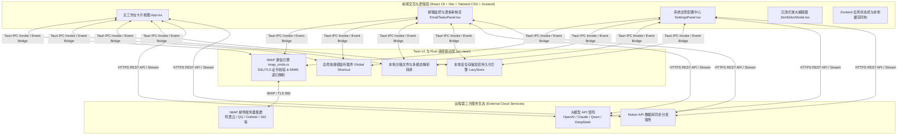

# TaskPilot 现代智能效率控制台 —— 软件需求规格说明书 (SRS)

**文档版本**：v1.0.0 (Release Edition)  
**更新日期**：2026-07-27  
**受众对象**：产品经理、全栈架构师、后端/前端工程师、测试工程师、安全审计人员及系统使用人员  
**归档位置**：`doc/TaskPilot需求规格说明书.md`  

---

## 1. 引言 (Introduction)

### 1.1 编写目的
本文档是 **TaskPilot 现代智能效率控制台** 的详细软件需求规格说明书（Software Requirements Specification, SRS）。本文档全面系统地提炼并规定了该系统当前的业务全景、系统架构、功能规格要求、非功能性指标、交互接口约束与底层数据模型。为产品的后续研发迭代、自动化测试断言、安全验收测试以及用户部署使用提供唯一权威的技术依据。

### 1.2 产品定位与核心价值
TaskPilot 是一款基于 **Tauri v2 + React 19 + Rust** 混合架构打造的下一代跨平台 AI 驱动效率办公自动化控制台。系统直击现代工作流中**“零散多源信息繁杂 -> 关键待办易被淹没 -> 跨团队协同输入繁琐”**的核心痛点，构建了完全在本地沙箱独立运行的智能闭环工作台：
1. **统一输入入口**：打通剪贴板、多模态文档（Word/Excel/PDF）、即时粘贴与多邮箱 IMAP 自动化监听。
2. **AI 降噪提炼引擎**：结合自定义个人工作重点与提示词，自动剥离冗余历史回复与无意义内容，提取高价值可执行待办。
3. **动态字段映射与闭环推送**：实时内省连接 Notion 数据库 Schema，将结构化待办精准映射分发至协同工作平台。

### 1.3 术语与缩写定义
| 术语 / 缩写 | 英文全称 / 对应概念 | 详细定义与解释 |
| :--- | :--- | :--- |
| **SRS** | Software Requirements Specification | 软件需求规格说明书。 |
| **VEP Core** | Vite + Electron/Tauri + PWA | 跨平台桌面端开发应用底层技术栈组合。 |
| **IMAP Slice** | IMAP Thread Noise Reduction & Slicing | 针对长链邮件中 `From:`, `Date:` 等历史转寄回复盖楼进行的智能降噪切片与手风琴折叠矩阵引擎。 |
| **Failover Engine** | LLM Failover Rotation Engine | 大模型高可用故障转移轮换引擎。当主模型遇到 API 限流、超时或停机时，自动重试并切换备用供应商节点。 |
| **LazyStore** | Tauri Plugin Store + Encrypted Storage | 采用 AES/ChaCha20 算法加密的本地沙箱持久化存储引擎，对用户透明，零外部依赖。 |
| **Zen Editor** | Zen Expand/Zoom-in Fullscreen Editor | 专为 1024×768 黄金视窗适配设计的全屏沉浸式放大编辑器，具备实时字数统计、AI 润色联动与防误删保护。 |

---

## 2. 总体设计与系统架构 (Overall Architecture)

### 2.1 体系架构剖析
系统严格采用**前后端职责分离、底层安全驱动、上层响应渲染**的现代化桌面架构：



### 2.2 运行环境与视窗规格
- **目标操作系统**：Windows 10/11 x64、macOS (Intel/Apple Silicon)、Linux。
- **界面自适应黄金规格**：系统全视角严格遵循 **`1024 × 768` 黄金自适应视窗布局**。各类模态框、列表盒与表单均经过严格的滚动条及溢出截断计算，保证在固定视窗下呈现沉浸级排版。

---

## 3. 功能需求规格 (Functional Requirements)

本节依据模块化业务链路，将系统功能划分为四大核心业务子系统：

### 3.1 模块一：多源信息导入与 AI 待办降噪提取 (Multi-Source Input & AI Task Extraction)

#### REQ-IN-001: 跨平台多模态智能输入与解析
- **需求概述**：系统需支持全媒体场景下的文本和附件资产快速录入与智能转译。
- **输入途径**：
  1. **手动粘贴/编辑**：主工作台提供可调行高文本框，支持任意杂乱会议记录、需求沟通群聊记录的输入。
  2. **剪贴板智能抓取**：一键读取操作系统剪贴板中的最新文本或多格式内容。
  3. **多模态文件原生解析**：支持直接向操作区拖拽 PDF、Word (`.docx`)、Excel (`.xlsx`) 文件。底层通过本地沙箱算法自动解构文档段落与表格数据，转换为结构化纯文本。
- **验证断言**：拖拽不少于 5MB 的复杂分栏 PDF/Word/Excel 报表，系统需在 500ms 内完成无损离线解析。

#### REQ-IN-002: 基于自定义偏好的 AI 待办提炼
- **需求概述**：调用大模型将非结构化文本转化为标准的可执行待办卡片数组。
- **业务标准与过滤规则**：系统在组装 Prompt 时，强制注入设置面板中的 **《个人关注方向 (Personal Focus)》** 作为最高准则。严格过滤无关寒暄、背景陈述，仅保留和关注重点对应的可操作任务。
- **输出数据模型**：提取完成的待办事项包含：基本主题 (`title`)、执行描述 (`description`)、建议处理人/优先序、原始溯源绑定标签，且默认全部处于已选中可同步状态 (`selected: true`)。

#### REQ-IN-003: 意图驱动的智能写作与文本润色
- **需求概述**：为主工作台赋能写作辅助与商务沟通润色能力。
- **功能细节**：用户输入简短的“初始意图”（如：“告诉客户延迟发版，因为接口联调异常”），点击生成后，系统结合身份设定，输出规范、委婉且符合商业商务礼仪的邮件回信或会议纪要。

---

### 3.2 模块二：IMAP 邮箱自动化监控与降噪排毒矩阵 (IMAP Email Automation)

#### REQ-EM-001: 多目标服务商与多文件夹定时轮询
- **需求概述**：实现无人值守的后台邮件自动拉取与本地处理。
- **参数规格**：支持配置服务器地址、端口（默认 993 SSL/TLS）、账户名及凭据；支持自定义监听目标文件夹（例如输入：`INBOX, Work, Urgent`，系统依次建立多目录异步连接遍历拉取新邮件）。
- **定时与调度控制**：提供每 5 分钟至 1 小时可自定义的定时轮询调度器；支持主控制台手动点击 **“立即扫描 (Scan Now)”**。
- **底层容错**：严密保证在参数传递期间传入每个迭代目标的真实目录名 (`folder: folder`)，彻底消灭 `Mailbox does not exist` 报错；若成功提炼出待办，可根据用户开关配置选择是否自动在邮件服务器上把该邮件标记为已读 (`\Seen`)。

#### REQ-EM-002: 万字长链邮件降噪切片与手风琴折叠矩阵 (MIME Slicing & Accordion Matrix)
- **需求概述**：针对长期往返转发、包含几十层历史回复的“长链盖楼邮件”，系统必须在进入大模型分析与 UI 渲染前进行降噪和结构化拆解。
- **切片规则**：基于正则表达式与语义标签匹配，自动识别邮件正文中的分隔线（如：`-----Original Message-----`、`From: xxx Date: xxx Subject: xxx` 等），精准切离历史盖楼内容，仅提炼最新一条核心正文或将历史脉络切片存储。
- **手风琴交互矩阵**：
  - **单卡片局部操作**：在单封邮件审核卡片中，提供 **`[ 📖 展开历史回复 (N) ]`** / **`[ 📜 收起历史回复 ]`** 的独立手风琴开关。
  - **全景全局联动**：在历史记录顶栏提供 **`[ ⚡ 全局一键展开/收起历史回复 ]`** 总闸，让用户在几千字与精简版之间一键切换。

#### REQ-EM-003: 双模监控视图与逐条深度审核模式 (Review Mode)
- **需求概述**：提供多种符合不同人群操作习惯的监控数据展示流。
- **双模架构**：
  1. **全景历史聚合列表 (History List View)**：以高密度卡片展现历史处理纪要，支持按 “已审核”、“已推送 Notion”、“待处理” 状态标签及所属监听文件夹动态筛选；支持日志记录区的收起/展开。
  2. **逐条深度审核模式 (Interactive Review Mode)**：用户点击进入该模式后，系统按照时间顺序，从最新到最旧一条条引导审核。
- **逐条审核功能对齐**：在该模式下，支持查看邮件原始正文及附件详情；支持手动对已提炼的待办卡片进行修改、删除或新增；支持完成一条后勾选是否标记为 **“已审核 (Reviewed)”** 并平滑切换至下一条。

#### REQ-EM-004: 多模态附件与内联图像解析展示
- **需求概述**：保证邮件附件与图文交织邮件信息的完整性。
- **处理规范**：底层 Rust 解析 MIME 结构时，自动提取正文中的内联图像引用 (`cid:...`) 并在内存中无损转码为 `data:image/png;base64,...` 数据流，直接在邮件详情窗内无缝渲染显现；同时把常规附件清单提供给前端一键预览或解析。

#### REQ-EM-005: 后台处理风暴防护与去重持久化
- **需求概述**：杜绝网络抖动或周期重试引来的日志污染。
- **防重试风暴算法**：当某封邮件由于网络异常或限流处理失败时，系统将通过复合主键 `findIndex(item => item.folder === result.folder && item.emailUid === result.emailUid)` 对历史日志进行检索：
  - 若该卡片此前已存在，系统**原地覆写更新**最新报错时间与重试状态；
  - 严禁盲目 `unshift` 堆砌插入重复报错日志卡片，确保系统运行数日也不会产生垃圾日志条目。
- **扫描控制器**：提供明确的“暂停扫描 / 继续扫描 / 停止中断”控制钮，并实时反馈当前处理进度的精简文字（防文字超长挤压界面）。

---

### 3.3 模块三：Notion 动态属性映射与分发引擎 (Notion Dynamic Schema & Dispatch Engine)

#### REQ-NO-001: 数据库元数据远程内省 (Schema Introspection)
- **需求概述**：实现对任意复杂 Notion Database 的零配置自适应对齐。
- **业务流程**：用户在设置中心填入 API Token 与 Target Database ID 后，点击 **“同步 Notion 属性 (Test & Fetch Schema)”**。系统发起 HTTPS 远程呼叫，拉取该 Database 下所有实际字段名称、唯一 ID、字段数据类型（例如：`Status`, `Select`, `Multi-select`, `Date`, `Rich text`, `Number`, `Checkbox`, `URL`, `Email` 等）。

#### REQ-NO-002: 可配置字段映射字典与提示词指导 (`aiHint`)
- **需求概述**：允许用户自定义待办卡片中各项内容对应落地到 Notion 数据库的哪一列。
- **自定义映射配置**：提供可视化的配置面板，支持逐个启用或关闭某些属性的映射同步；针对每个复杂字段，允许用户填写具体的 **`aiHint` (大模型指导约束)**（例如对自定义的 `优先级` 属性配置 `aiHint: "仅限填写：P0-紧急, P1-重要, P2-普通"`），系统在提炼时将严格遵循该值域约束。

#### REQ-NO-003: 划选待办自动溯源与分发保护
- **需求概述**：打通阅读、划选、提取到分发的一站式体验。
- **划选溯源 (Selection Traceability)**：当用户在主工作台或邮件预览区任意选中一段具体文字并选择“提炼选中文本为待办”时，系统创建的新待办将自动锚定并记录：**出处来源（邮件名/文件名）、选定上下文内容、原始跳转锚点链接**。
- **分发安全保障**：
  - 点击 **“同步至 Notion”** 时，系统过滤所有勾选 (`selected !== false`) 且尚未同步 (`!synced`) 的任务并发起批量同步；
  - **空选保护防护 (Empty Sync Guard)**：若检测到有效可选任务列表为空（因为全部都已同步成功，或用户把勾选全部取消），系统立即拦截并弹出友善人性的告警提示（`"当前没有可同步的待办事项：您选中的条目可能已全部同步至 Notion，或未勾选任何有效事项。"`），避免无声静默或系统误判卡死。

---

### 3.4 模块四：AI 故障转移引擎与全局高定组件 (AI Failover & Zen Components)

#### REQ-SYS-001: 多供应商矩阵与动态容灾轮换 (Failover Rotation Engine)
- **需求概述**：解决单一大模型服务商突发网络故障、限流封锁或宕机导致的业务停摆问题。
- **供应商矩阵管理**：
  - 允许添加多个大模型服务商配置（例如同时存有：OpenAI 官方、通义千问 API、本地 Ollama 服务端、DeepSeek 等）；
  - 支持通过 **“↑ 上移 / ↓ 下移”** 动态调整服务商优先级；
  - 内置一键 **“测试连通性 (Test Connection)”** 工具，发送轻量探活请求断言节点健康状态。
- **自动故障转移机制**：
  - 提供开关 `开启异常自动轮换 (Failover Rotation)` 及自定义 `单节点失败最大重试次数 (默认 1 次)`；
  - 运行时发生网关超时、429 限流或 5xx 崩溃时，底舱自动拦截该异常并按照优先级列表平滑将流量路由至后备节点重新尝试，做到**对上层业务无感、永不丢单**。
- **深度推理支持**：针对 `o1`, `o3-mini`, `claude-3.7` 等具有思维链的思考模型，提供“允许大模型进入深度思考与推理模式”开关。开启后，系统解析参数并延长底舱超时阈值。

#### REQ-SYS-002: 全视窗沉浸式放大编辑与保存 (`ZenEditorModal`)
- **需求概述**：针对配置复杂长篇提示词（如《个人关注方向》等数千字规则）时原卡片小框易造成排版断层的局限，提供专业级大视野无干扰创作控制台。
- **界面规格**：点击“⛶ 放大编辑”后，在当前窗口上方悬浮展开 900x640 的沉浸式大视野编辑模态窗（约占 1024×768 窗口的 88% 核心区域），配合毛玻璃渐变遮罩 (`backdrop-blur-md`) 与 `leading-relaxed` 1.75 倍行距。
- **功能矩阵**：
  - **实时统计**：右上角呈现实时打字计算的 **字数与行数统计 Badge** (`字数: XXX | 行数: XX`)。
  - **AI 润色联动**：模态窗底栏原位集成 **`[ ✨ AI 智能润色 ]`** 与 **`[ ↩️ 撤销润色 ]`**，直接在大视窗下调动大模型对现存规则进行扩充和优化并支持对比撤销。
  - **极速工作流与防误触 (Dirty Check)**：支持 `Ctrl + Enter` (Windows) / `Cmd + Enter` (Mac) 极速保存写回；当用户在窗内编辑修改了大量文字却忘保存直接按 Esc 或点击背景关闭时，系统主动拦截并触发防丢失提醒确认（`"检测到未保存的修改，现在退出将丢失更改，是否确认放弃？"`），彻底斩断误操作丢字风险。

#### REQ-SYS-003: 全局热键与底层响应控制
- **需求概述**：保障办公场景的高效呼出与隐藏。
- **全局呼出热键**：基于 `@tauri-apps/plugin-global-shortcut`，允许在系统设置中录入自定义组合按键（如：`Alt + Space` / `Cmd + Shift + T`）。无论当前聚焦于 IDE 还是浏览器，按下热键瞬间唤醒或隐藏前台界面。

---

## 4. 非功能性需求 (Non-Functional Requirements)

### 4.1 安全性与数据隐私 (Security & Privacy)
- **本地沙箱执行**：所有本地文档（PDF/Word/Excel）解析读取 100% 在客户端沙箱内存中独立完成。系统不存在任何第三方遥测、行为统计或云端存留。
- **敏感凭据底层加密**：所有配置的 API Key、Notion Token、邮箱账号及授权登录密码均使用本地底层加密存储库 (`LazyStore`) 序列化落盘，绝对防范明文被第三方窃取。
- **加密链路强制通信**：底层网络通信、IMAP 连接拉取一律强制启用 TLS/SSL 会话加密。

### 4.2 性能与资源占用指标 (Performance Indicators)
| 监控维度 | 性能规格要求 / 指标阈值 | 测量环境断言 |
| :--- | :--- | :--- |
| **启动耗时 (Cold Start)** | ≤ 1.5 秒 | 从点击应用桌面图标至核心界面渲染完成可见。 |
| **长文本/多模态解析** | ≤ 500 毫秒 | 针对 5MB 内分栏 Word/Excel/PDF 文档或千万字级邮件切片。 |
| **内存静态驻留** | ≤ 80 MB | 系统常驻系统托盘或后台静默轮询时的占用封顶。 |
| **前台交互帧率** | 稳定 60 FPS | 在 1024×768 黄金窗口下展开手风琴、拖动大视窗时的动画顺滑度。 |

### 4.3 兼容性要求 (Compatibility)
- **客户端打包分发**：支持构建出标准的 Windows `NSIS Setup` 图形化导向安装包及企业级 `MSI` 系统静默部署包；同时原生支持 macOS 及 Linux 编译。

---

## 5. 数据字典与安全持久化规范 (Data Dictionary & Storage Schema)

系统全部状态由 `useSettingsStore`、`useHistoryStore`、`useScannerStore` 和 `useLLMProviderStore` 管理，并依托本地隔离的 `.enc` 文件持久化存储。主要业务实体结构定义如下：

### 5.1 大模型供应商配置表 (`LLMProvider`)
```typescript
interface LLMProvider {
  id: string;              // 供应商节点唯一 UUID
  name: string;            // 供应商名称 (如：阿里云通义千问、OpenAI 主节点)
  apiBaseUrl: string;      // API Base URL (兼容 OpenAI 规范的请求路径)
  apiKey: string;          // 对应 API Bearer Key (底层自动密文化持久保存)
  modelName: string;       // 调用的具体模型模型标签 (如：qwen3.7-plus, gpt-4o, claude-3.5-sonnet)
  priority?: number;       // 故障转移引擎调用顺位权值 (数字越小优先级越高，0 为首发默认节点)
}
```

### 5.2 邮箱监控配置实体 (`EmailConfig`)
```typescript
interface EmailConfig {
  host: string;            // IMAP 邮件收信服务器地址 (如：imap.aliyun.com)
  port: number;            // 端口号 (默认 993)
  ssl: boolean;            // 是否启用 SSL/TLS 安全通信 (默认 true)
  user: string;            // 授权登录邮箱账户名
  pass: string;            // 专用客户端应用授权码或密码
  targetFolder: string;    // 监控目标文件夹列表 (逗号分隔支持多个，如：INBOX, Work, Urgent)
  pollInterval: number;    // 后台轮询时间间隔 (单位：分钟)
  markAsRead: boolean;     // 提炼成功后是否将服务器源邮件自动加注已读标记 \Seen
  enabled: boolean;        // 当前邮箱后台监听总闸开关
}
```

### 5.3 Notion 属性动态映射表 (`FieldMapping`)
```typescript
interface FieldMapping {
  notionPropId: string;    // Notion 数据库内部真实列属性 ID
  enabled: boolean;        // 是否在待办生成时推送到此列属性
  aiHint: string;          // 给大模型生成该属性值时的专属约束指令 (如："格式必须为 YYYY-MM-DD")
  order: number;           // 前台面板与表单呈现排序顺序
}
```

### 5.4 待办卡片与邮件处理记录 (`EmailHistoryItem` & `TodoItem`)
```typescript
interface TodoItem {
  id: string;              // 待办卡片唯一 UUID
  title: string;           // 待办精炼标题
  description?: string;    // 任务执行细节与上下文摘要
  selected?: boolean;      // 当前是否被勾选进入下一步同步队列 (默认 true)
  synced?: boolean;        // 是否已被分发同步写入至 Notion 数据库
  sourceUrl?: string;      // 原始关联溯源链接或邮件原件锚点 ID
  properties?: Record<string, any>; // 根据 Schema 自适应映射的键值动态属性矩阵
}

interface EmailHistoryItem {
  batchId: string;         // 批次执行流水号
  timestamp: number;       // 触发处理的绝对纪元时间戳 (毫秒)
  emailUid: number;        // IMAP 协议定义的邮件局部唯一 ID (UID)
  folder?: string;         // 该封邮件具体隶属于哪个监视文件夹 (如：INBOX / Work)
  subject: string;         // 邮件原件主题
  sender: string;          // 发件人全名与邮箱绝对路径
  receivedDate: string;    // 邮件信封接收日期
  status: 'pending' | 'success' | 'failed' | 'ignored'; // 终态执行标记
  aiResult?: {
    todos: TodoItem[];     // 自适应解构并提炼出的待办任务清单数组
  };
  errorMsg?: string;       // 失败重试时的错误栈说明（结合复合主键实现历史日志原地复写与去重）
}
```

---

## 6. 验证、验收与监控规划 (Verification & Acceptance Plan)

为确立全产品链路处于稳定成熟状态，项目建立有闭环式的工程化测试与验收体系：
1. **自动化类型断言与单元测试**：针对长链切片 (`emailThreadParser.test.ts`)、底舱调取去重 (`emailScheduler.test.ts`) 和核心状态机 (`store.test.ts`) 进行自动化运行：
   ```powershell
   npm test && npx tsc --noEmit
   ```
   **断言标准**：核心单元测试通过率必须长期保持 **100%** 绿色通过，且无任何 TypeScript 隐式异常。
2. **生产环境编译断言**：通过 Vite 转译及 Rust Cargo 构建：
   ```powershell
   npm run tauri build
   ```
   **断言标准**：产出全独立自包含的 Windows/macOS 离线分发二进制安装包。
3. **视觉与自动化操作验证**：通过本地调试启动或借助专门的 `Browser Agent` / E2E 自动化工具打开应用，全量断言在 1024×768 下手风琴折叠、沉浸式编辑窗调用与未保存提示等交互响应流畅无阻。
